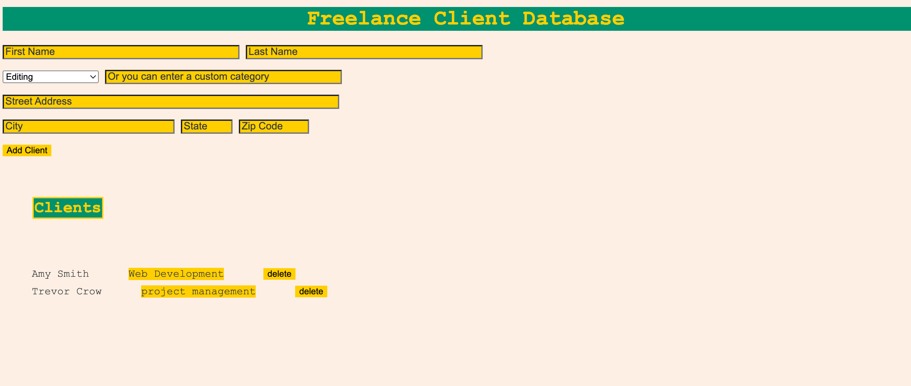

# Project Overview
Freelance Database is a simple, lightweight webpage that accomplishes one thing: It allows freelance workers to track a basic database of their clients. This was one of first projects I worked on as I began to learn JavaScript fundamentals, so it is not meant to take a deep dive into everything a freelancer might need in their database.

I created all the code for this website, including the logic for the database, the HTML front-end, and the overall design.

The following technologies were used in the creation of this project:

* Visual Studio Code
* JavaScript
* HTML
* CSS
* Git

# Development
This project started as a practice project during a web development course I took on Zero to Mastery's website. The bones of this website started out as a to-do list that saved each task in browser memory. As I have a background as a freelancer, I saw an immediate application for this as the beginning of a simple set of tools for freelancers who didn't want to sign up for a new service. This website also allows them to use something simple that doesn't require much of a learning curve because its operation is pretty straight forward.

The foundation of the project lies in its main functionality: to keep a simple database of freelance clients that saves on resources by saving onto the end user's browser memory. When I originally created this app, I also hadn't yet learned how to implement user login, so it served as a launching point for me to start creating my own projects based on what I'd learned so far.

The project is still currently under development because it still lacks a few features to have full CRUD functionality. I'm currently working on implementing a modal that displays the detail of each client and would allow the end user to edit the details.

# Solution Design

I started this project at the beginning of my web development education, so it lacks some features one might find in a fully developed web application that has a use in the real world. My original intent was to use this as a building block for creating a complex project management solution for freelance workers that provided them with an array of tools they would need to simplify their workflow. Because of this, it is a work in progress that I'll continue to add to as my knowledge and experience grows.

## Upcoming Plans

As of September 2024, I am upgrading my skills to include back-end Node.js and PostgreSQL. So, I am currently working on a strategy to migrate the original code to a Node.js back-end that makes use of a relational database. Once that migration is complete, I'll finish the full CRUD implementation of the basic client database, add user authentication, and create a strategy for implementing more intricate features to make the site useful for freelancers.

# Current Design

